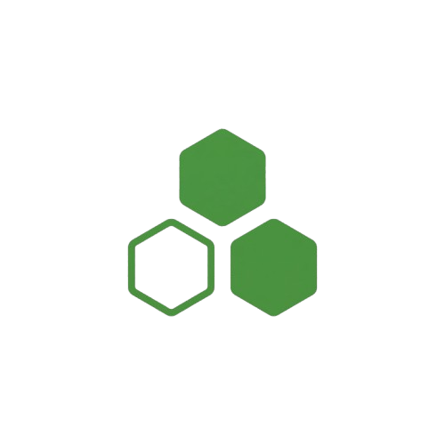

<p align="center">
  
</p>

# Fabric Data Agent Community Hub

[fabricdataagent.com](https://fabricdataagent.com) is a community-driven website for Microsoft Fabric Data Agents. It brings together articles, videos, tools, events, LinkedIn posts, and learning resources created and shared by the community.

Anyone can contribute. No pull requests or code knowledge required.

## How to Contribute

All content is submitted through GitHub Issues. Pick the type of content you want to share, fill out the form, and a maintainer will review and approve it. Once approved, your content appears on the site automatically.

| Content Type | Submit Here |
|---|---|
| Article / Blog Post | [Submit an Article](https://github.com/pawarbi/fabric-data-agent-website/issues/new?template=article.yml) |
| YouTube Video | [Submit a Video](https://github.com/pawarbi/fabric-data-agent-website/issues/new?template=video.yml) |
| Event (conference, webinar, meetup) | [Submit an Event](https://github.com/pawarbi/fabric-data-agent-website/issues/new?template=event.yml) |
| LinkedIn Post | [Submit a LinkedIn Post](https://github.com/pawarbi/fabric-data-agent-website/issues/new?template=linkedin.yml) |
| Tool or Library | [Submit a Tool](https://github.com/pawarbi/fabric-data-agent-website/issues/new?template=tool.yml) |
| Resource (docs, tutorials, repos) | [Submit a Resource](https://github.com/pawarbi/fabric-data-agent-website/issues/new?template=resource.yml) |

You can also visit the [Contribute](https://fabricdataagent.com/contribute/) page on the site for more details.

## What happens after you submit

1. You fill out an issue form with the details of your content
2. A maintainer reviews the submission and adds the `approved` label
3. A GitHub Actions workflow automatically creates the content file, merges it, and deploys the site
4. Your content goes live within minutes

## Reporting bugs or suggesting improvements

If you find a bug or have an idea to improve the site, [open an issue](https://github.com/pawarbi/fabric-data-agent-website/issues/new?template=bug-report.yml) and describe what you found or what you would like to see.

## Running the site locally

```bash
npm install
npm run dev
```

The site will be available at `http://localhost:4321`.

To build for production:

```bash
npm run build
```

## Content Ownership

All linked articles, blog posts, videos, and other content remain the intellectual property of their respective original authors and publishers. This site provides summaries and links for educational and informational purposes only. If you are a content owner and would like your content removed, please [open a GitHub issue](https://github.com/pawarbi/fabric-data-agent-website/issues).

## Tech Stack

- [Astro](https://astro.build) for static site generation
- [Tailwind CSS](https://tailwindcss.com) for styling
- [Pagefind](https://pagefind.app) for search
- [GitHub Pages](https://pages.github.com) for hosting
- [Umami](https://umami.is) for privacy-friendly analytics
- [D3.js](https://d3js.org) for the knowledge graph on the Explore page

## Disclaimer

**This website is not affiliated with, sponsored by, or endorsed by Microsoft Corporation.** It is an independent, community-built open source project. All linked content remains the property of its original authors. Microsoft, Microsoft Fabric, and other Microsoft product names are trademarks or registered trademarks of Microsoft Corporation in the United States and other countries. All other trademarks are the property of their respective owners.

## License

This project is open source. Contributions are welcome from everyone in the Fabric community.
